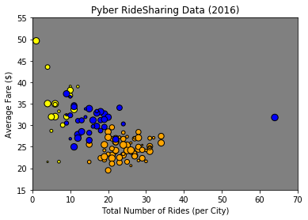
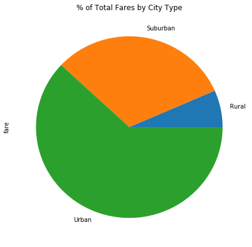
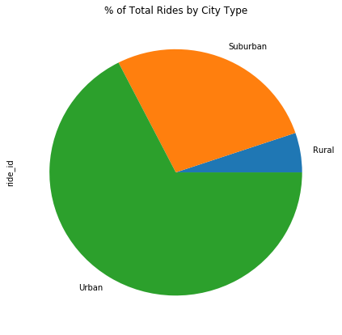

```python
#Observed Trend 1
#Observed Trend 2
#Observed Trend 3
```


```python
import matplotlib.pyplot as plt
import pandas as pd
import numpy as np
```


```python
city_data = "raw_data/city_data.csv"
ride_data = "raw_data/ride_data.csv"
```


```python
city_data_pd = pd.read_csv(city_data)
ride_data_pd = pd.read_csv(ride_data)
```


```python
city_data_pd.head()
```


<div>
<style scoped>
    .dataframe tbody tr th:only-of-type {
        vertical-align: middle;
    }

    .dataframe tbody tr th {
        vertical-align: top;
    }

    .dataframe thead th {
        text-align: right;
    }
</style>
<table border="1" class="dataframe">
  <thead>
    <tr style="text-align: right;">
      <th></th>
      <th>city</th>
      <th>driver_count</th>
      <th>type</th>
    </tr>
  </thead>
  <tbody>
    <tr>
      <th>0</th>
      <td>Kelseyland</td>
      <td>63</td>
      <td>Urban</td>
    </tr>
    <tr>
      <th>1</th>
      <td>Nguyenbury</td>
      <td>8</td>
      <td>Urban</td>
    </tr>
    <tr>
      <th>2</th>
      <td>East Douglas</td>
      <td>12</td>
      <td>Urban</td>
    </tr>
    <tr>
      <th>3</th>
      <td>West Dawnfurt</td>
      <td>34</td>
      <td>Urban</td>
    </tr>
    <tr>
      <th>4</th>
      <td>Rodriguezburgh</td>
      <td>52</td>
      <td>Urban</td>
    </tr>
  </tbody>
</table>
</div>


```python
ride_data_pd.head()
```


<div>
<style scoped>
    .dataframe tbody tr th:only-of-type {
        vertical-align: middle;
    }

    .dataframe tbody tr th {
        vertical-align: top;
    }

    .dataframe thead th {
        text-align: right;
    }
</style>
<table border="1" class="dataframe">
  <thead>
    <tr style="text-align: right;">
      <th></th>
      <th>city</th>
      <th>date</th>
      <th>fare</th>
      <th>ride_id</th>
    </tr>
  </thead>
  <tbody>
    <tr>
      <th>0</th>
      <td>Sarabury</td>
      <td>2016-01-16 13:49:27</td>
      <td>38.35</td>
      <td>5403689035038</td>
    </tr>
    <tr>
      <th>1</th>
      <td>South Roy</td>
      <td>2016-01-02 18:42:34</td>
      <td>17.49</td>
      <td>4036272335942</td>
    </tr>
    <tr>
      <th>2</th>
      <td>Wiseborough</td>
      <td>2016-01-21 17:35:29</td>
      <td>44.18</td>
      <td>3645042422587</td>
    </tr>
    <tr>
      <th>3</th>
      <td>Spencertown</td>
      <td>2016-07-31 14:53:22</td>
      <td>6.87</td>
      <td>2242596575892</td>
    </tr>
    <tr>
      <th>4</th>
      <td>Nguyenbury</td>
      <td>2016-07-09 04:42:44</td>
      <td>6.28</td>
      <td>1543057793673</td>
    </tr>
  </tbody>
</table>
</div>


```python
#Your objective is to build a Bubble Plot that showcases the relationship between four key variables:

#Average Fare ($) Per City
#Total Number of Rides Per City
#Total Number of Drivers Per City
#City Type (Urban, Suburban, Rural)
```


```python
combined_data = pd.merge(ride_data_pd, city_data_pd, on="city")
combined_data.head()

```


<div>
<style scoped>
    .dataframe tbody tr th:only-of-type {
        vertical-align: middle;
    }

    .dataframe tbody tr th {
        vertical-align: top;
    }

    .dataframe thead th {
        text-align: right;
    }
</style>
<table border="1" class="dataframe">
  <thead>
    <tr style="text-align: right;">
      <th></th>
      <th>city</th>
      <th>date</th>
      <th>fare</th>
      <th>ride_id</th>
      <th>driver_count</th>
      <th>type</th>
    </tr>
  </thead>
  <tbody>
    <tr>
      <th>0</th>
      <td>Sarabury</td>
      <td>2016-01-16 13:49:27</td>
      <td>38.35</td>
      <td>5403689035038</td>
      <td>46</td>
      <td>Urban</td>
    </tr>
    <tr>
      <th>1</th>
      <td>Sarabury</td>
      <td>2016-07-23 07:42:44</td>
      <td>21.76</td>
      <td>7546681945283</td>
      <td>46</td>
      <td>Urban</td>
    </tr>
    <tr>
      <th>2</th>
      <td>Sarabury</td>
      <td>2016-04-02 04:32:25</td>
      <td>38.03</td>
      <td>4932495851866</td>
      <td>46</td>
      <td>Urban</td>
    </tr>
    <tr>
      <th>3</th>
      <td>Sarabury</td>
      <td>2016-06-23 05:03:41</td>
      <td>26.82</td>
      <td>6711035373406</td>
      <td>46</td>
      <td>Urban</td>
    </tr>
    <tr>
      <th>4</th>
      <td>Sarabury</td>
      <td>2016-09-30 12:48:34</td>
      <td>30.30</td>
      <td>6388737278232</td>
      <td>46</td>
      <td>Urban</td>
    </tr>
  </tbody>
</table>
</div>


```python
total_driver_city = city_data_pd["driver_count"]
```


```python
#Total Rides by City Type
city_group = combined_data.groupby(['type','city'])
total_city_rides = city_group['ride_id'].count()

#urban
urban_id_count = "Urban"
just_urban_count  = total_city_rides.loc[urban_id_count]

#rural
rural_id_count = "Rural"
just_rural_count  = total_city_rides.loc[rural_id_count]

#Suburban
sub_id_count = "Suburban"
just_sub_count  = total_city_rides.loc[sub_id_count]
```


```python
#Average Fare ($) Per City
urban_data = combined_data.groupby(['type','city'])
avg_fare = urban_data['fare'].mean()

#urban
urban_id_avg = "Urban"
just_urban_avg = avg_fare.loc[urban_id_avg]

#rural
rural_id_avg = "Rural"
just_rural_avg = avg_fare.loc[rural_id_avg]

#rural
sub_id_avg = "Suburban"
just_sub_avg = avg_fare.loc[sub_id_avg]

```


```python
plt.title("Pyber RideSharing Data (2016)")
plt.xlabel("Total Number of Rides (per City)")
plt.ylabel("Average Fare ($)")

plt.ylim(15,55)
plt.xlim (0,70)

plt.scatter(just_urban_count, just_urban_avg, s=total_driver_city, marker="o", facecolors="orange", edgecolors="black")
plt.scatter(just_rural_count, just_rural_avg, s=total_driver_city, marker="o", facecolors="yellow", edgecolors="black")
plt.scatter(just_sub_count, just_sub_avg, s=total_driver_city, marker="o", facecolors="blue", edgecolors="black")
plt.show()
```





```python
# % of Total Fares by City Type

total_fare = combined_data['fare'].sum()
type_fare = combined_data.groupby('type')
total_fare_type = type_fare['fare'].sum() / total_fare * 100
total_fare_type

fare_chart = total_fare_type.plot(kind='pie', figsize=(7,7), title=("% of Total Fares by City Type"))


```





```python
# Total Rides by City Type
type_group = combined_data.groupby('type')
total_type_rides = type_group['ride_id'].count()
total_rides_type = total_type_rides / total_type_rides.sum() * 100

rides_chart = total_rides_type.plot(kind='pie', figsize=(7,7), title=("% of Total Rides by City Type"))
```





```python
driver_group = combined_data.groupby('type')
driver_type_group = driver_group['ride_id'].count()

driver_chart = driver_type_group.plot(kind='pie', figsize=(7,7), title=("% of Total Rides by City Type"))
```


